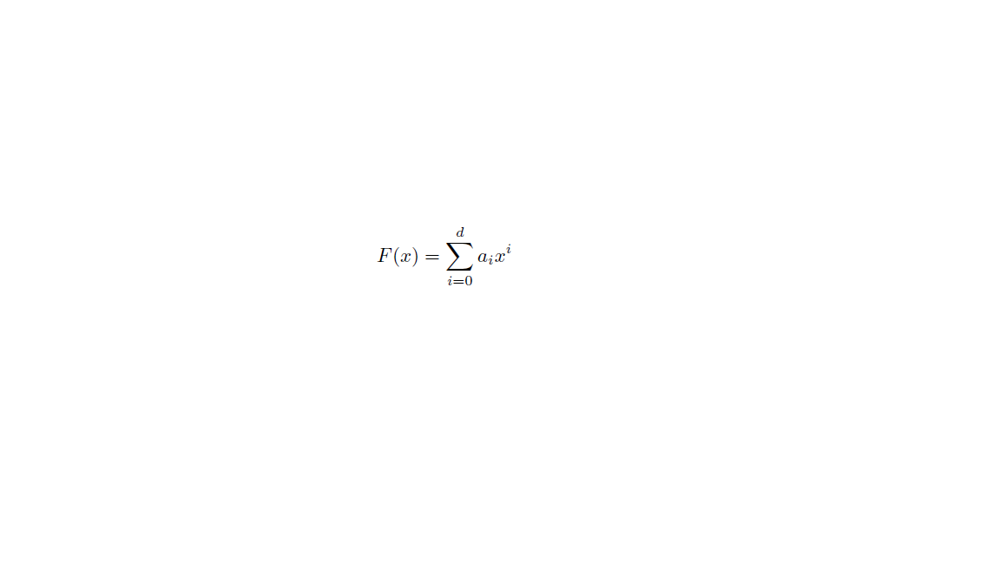

## Polynomial Expansion with CUDA

Implementing a simple CUDA program to compute a polynomial function F of degree d

for an array n of values x

### Polynomial.cpp is the CPU version that fills the array on the CPU and transfers it to the GPU (Size N)

### Polynomial_gpu.cu is the CUDA program that computes the expansion of each element of the array on the GPU (Block size and degree d as parameters)